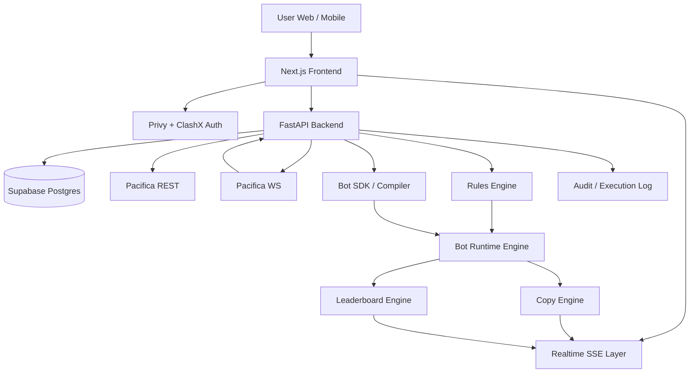

# Implementation Plan: ClashX Bot Builder Platform

**Execution Branch**: `master` (no new branches) | **Feature Context**: `001-clashx-social-trading` | **Date**: 2026-03-12  
**Spec**: `/specs/001-clashx-social-trading/spec.md`

## Summary

Rebuild ClashX from a manual social trading product into a Pacifica-native bot platform.

MVP sequence:
1. delegated per-user wallet authorization,
2. block/template-based bot creation for non-advanced users,
3. SDK/library-based bot creation for advanced users,
4. bot deployment and runtime control,
5. public bot leaderboard,
6. bot copying by live mirroring and cloning.

The product should not depend on a self-directed trade desk. Instead, users deploy bots that act on their wallets through a delegated Pacifica runtime.

## Product Decisions Locked for This Plan

- **Execution model**: per-user delegated wallet only.
- **Authoring model**: dual-path. Visual builder for mainstream users, SDK/library for advanced users, both targeting the same bot-definition/runtime model.
- **Execution depth**: advanced Pacifica execution controls are first-class, not deferred.
- **Copy model**: support both mirror and clone flows in product design; sequence delivery pragmatically.
- **Manual trading UX**: deprecated.

## Technical Context

**Language/Version**: Python 3.11 (backend), TypeScript + Next.js 16.1.6 (frontend)  
**Primary Dependencies**: FastAPI, Pacifica Python SDK / REST / WebSocket, Next.js App Router, Tailwind CSS, Privy, existing delegated authorization flow, SDK packaging for advanced bot authors  
**Storage**: Supabase Postgres  
**Validation Approach**: `ruff`, `mypy`, `pytest` for backend; `eslint`, `tsc --noEmit` for frontend; runtime simulation checks for rules evaluation and idempotent execution  
**Target Platform**: Web + mobile web, frontend on Vercel, backend worker/API on Railway/Render/Fly  
**Project Type**: Monorepo with frontend app, backend runtime service, and shared bot/rules schemas  
**Performance Goals**: rule trigger to Pacifica submit <= 2s median and <= 5s p95; leaderboard propagation <= 5s p95; pause/stop command propagation <= 2s p95  
**Constraints**: no manual trade-first product flows, delegated execution only, bot actions must be auditable, copy flows require explicit confirmation, visual and SDK authoring paths must converge into one normalized runtime model  
**Scale/Scope**: MVP for hundreds of active bot runtimes, dozens of concurrent leaderboard bots, and real-time copy relationships

## High-Level Architecture Diagram



## Constitution Check

*Gate status: PASS*

- **Code Quality**: Bot definitions, runtime state, and execution events must use typed schemas and versioned payloads.
- **UX Consistency**: Builder, deploy, pause, mirror, and clone actions must reuse consistent pending/success/failure and risk-confirmation patterns.
- **Performance**: Instrument rule evaluation latency, execution queue lag, Pacifica ack latency, and leaderboard fan-out delay.
- **Safety**: Every bot action must be idempotent, attributable, and stoppable.

## Data Model

1. **users**
   - `id`, `wallet_address`, `display_name`, `auth_provider`, `telegram_user_id?`, `created_at`
2. **delegated_authorizations**
   - `id`, `user_id`, `wallet_address`, `agent_wallet_address`, `status`, `created_at`, `updated_at`
3. **bot_definitions**
   - `id`, `user_id`, `name`, `description`, `visibility`, `market_scope`, `strategy_type`, `authoring_mode`, `rules_version`, `rules_json`, `sdk_bundle_ref?`, `created_at`, `updated_at`
4. **bot_runtimes**
   - `id`, `bot_definition_id`, `user_id`, `wallet_address`, `status`, `mode`, `risk_policy_json`, `deployed_at`, `stopped_at`, `updated_at`
5. **bot_execution_events**
   - `id`, `runtime_id`, `event_type`, `decision_summary`, `request_payload`, `result_payload`, `status`, `error_reason?`, `created_at`
6. **bot_leaderboard_snapshots**
   - `id`, `runtime_id`, `rank`, `pnl_total`, `pnl_unrealized`, `win_streak`, `drawdown`, `captured_at`
7. **bot_copy_relationships**
   - `id`, `source_runtime_id`, `follower_user_id`, `follower_wallet_address`, `mode (mirror|clone)`, `scale_bps`, `status`, `risk_ack_version`, `confirmed_at`, `updated_at`
8. **bot_clones**
   - `id`, `source_bot_definition_id`, `new_bot_definition_id`, `created_by_user_id`, `created_at`
9. **risk_policies**
   - `id`, `user_id`, `name`, `policy_json`, `created_at`, `updated_at`
10. **audit_events**
   - `id`, `user_id`, `action`, `payload_json`, `created_at`

## API Endpoints

### Auth / Runtime Authorization

- `GET /api/pacifica/authorize?wallet_address=...`
- `POST /api/pacifica/authorize/start`
- `POST /api/pacifica/authorize/{authorization_id}/activate`

### Bot Builder + Runtime

- `GET /api/bots`
- `POST /api/bots`
- `GET /api/bots/{bot_id}`
- `PATCH /api/bots/{bot_id}`
- `POST /api/bots/{bot_id}/validate`
- `POST /api/bots/{bot_id}/deploy`
- `POST /api/bots/{bot_id}/pause`
- `POST /api/bots/{bot_id}/resume`
- `POST /api/bots/{bot_id}/stop`
- `GET /api/bots/{bot_id}/events`

### Rules Engine / Builder Metadata

- `GET /api/builder/templates`
- `GET /api/builder/blocks`
- `GET /api/builder/markets`
- `POST /api/builder/simulate`

### SDK / Advanced Authoring

- `GET /api/sdk/manifest`
- `POST /api/sdk/validate`
- `POST /api/sdk/register`
- `GET /api/sdk/examples`

### Leaderboard + Discovery

- `GET /api/leaderboard/bots?status=active`
- `GET /api/leaderboard/bots/{runtime_id}`

### Copying

- `POST /api/bots/{runtime_id}/copy/preview`
- `POST /api/bots/{runtime_id}/copy/mirror`
- `POST /api/bots/{runtime_id}/copy/clone`
- `PATCH /api/copy/{relationship_id}`
- `DELETE /api/copy/{relationship_id}`

### Realtime

- `GET /api/stream/bots/{runtime_id}`
- `GET /api/stream/leaderboard/bots`
- `GET /api/stream/user/{user_id}`

## Component Breakdown

### Frontend

- `app/(app)/build` bot builder studio and deployment entry.
- `app/(app)/sdk` advanced authoring docs, package flow, and SDK registration entry.
- `app/(app)/bots` user-owned bot listing and runtime management.
- `app/(app)/bots/[botId]` bot detail, runtime health, rules, logs, advanced controls.
- `app/(app)/leaderboard` public bot leaderboard and discovery.
- `app/(app)/copy` mirror and clone management.
- `components/builder/*` rules canvas, parameter panels, validation states, template selector.
- `components/sdk/*` SDK docs panel, validation panel, and registration workflow.
- `components/bots/*` runtime status cards, execution logs, advanced control panels.
- `components/copy/*` mirror preview, clone summary, follower activity.
- `lib/sse-client.ts` shared realtime handling.

### Backend

- `api/bots.py` CRUD, validation, deploy, pause, resume, stop.
- `api/builder.py` templates, blocks, markets, simulations.
- `api/sdk.py` SDK manifest, validation, registration.
- `api/leaderboard_bots.py` bot leaderboard endpoints.
- `services/bot_builder_service.py` bot definition lifecycle.
- `services/rules_engine.py` block evaluation and trigger logic.
- `services/sdk_registry_service.py` SDK artifact registration and normalization.
- `services/bot_runtime_engine.py` queueing, execution, state transitions.
- `services/bot_copy_engine.py` mirror and clone behavior.
- `services/bot_leaderboard_engine.py` ranking and snapshot computation.
- `workers/bot_runtime_worker.py` active runtime orchestration.
- `workers/bot_reconcile_worker.py` upstream/DB reconciliation.

## Reuse from Existing Implementation

The current codebase already provides reusable building blocks:
- delegated Pacifica authorization flow,
- Pacifica client wrapper,
- auth/session plumbing,
- SSE infrastructure,
- basic leaderboard/copy concepts,
- operator scaffolding.

These should be adapted rather than rebuilt where practical.

## Project Structure

```text
specs/001-clashx-social-trading/
├── spec.md
├── plan.md
└── tasks.md

apps/
└── web/
   └── src/
      ├── app/
      ├── components/
      └── lib/

services/
└── trading-backend/
   └── src/
      ├── api/
      ├── services/
      ├── workers/
      └── models/

packages/
└── shared-types/
   └── bot-schemas/
```

## Sequencing / Phases

### Phase 0 - Product Pivot

- update spec/plan/tasks,
- remove remaining manual-trading assumptions,
- define bot-native terminology and event contracts.

### Phase 1 - Bot Builder Foundation

- create bot definition and runtime models,
- create builder templates/blocks schema,
- define SDK manifest and registration contract,
- implement validation and simulation APIs,
- ship first builder UI and advanced authoring entry.

### Phase 2 - Runtime Engine

- implement runtime deploy/pause/resume/stop,
- bind runtime to delegated authorizations,
- add advanced execution controls and idempotent action queue,
- emit runtime events.

### Phase 3 - Leaderboard + Discovery

- rank bot runtimes,
- expose public bot discovery surfaces,
- add bot profile and performance views.

### Phase 4 - Copying

- implement mirror preview and activation,
- implement clone flow into editable drafts,
- enforce follower risk controls,
- show copy telemetry and audit history.

### Phase 5 - Hardening

- reconciliation worker,
- latency instrumentation,
- runtime failure replay,
- demo and launch docs.

## Risks & Mitigations

1. **Rules engine becomes too open-ended**  
   Mitigation: constrain MVP to approved blocks, typed schemas, and versioned template families.
2. **SDK path diverges from visual builder semantics**  
   Mitigation: force SDK-authored bots through the same normalized bot-definition schema, validation pipeline, and runtime controls.
3. **Advanced execution complexity causes unsafe behavior**  
   Mitigation: central risk policy enforcement, dry-run validation, pause-first on invalid state.
4. **Delegated runtime drift or auth expiry**  
   Mitigation: heartbeat checks, auto-pause, visible re-authorization gating.
5. **Mirror mode introduces slippage or behavioral mismatch**  
   Mitigation: per-follower limits, explicit warnings, deterministic scaling rules, event logging.
6. **Clone mode leaks too much source IP**  
   Mitigation: separate public metadata from full private rule graphs; allow cloneable templates or sanitized configs only.

## Success Criteria Checks

1. A user can authorize a wallet, build a bot, deploy it, and inspect runtime events.
2. A public leaderboard shows bot competition rather than manual trader rankings.
3. A user can mirror a top bot with explicit confirmation.
4. A user can clone a bot into their own draft and edit it before deployment.
5. The system remains auditable, stoppable, and fast enough for live automation.

## Complexity Tracking

- No constitutional violations currently identified.
- Main complexity driver is keeping the visual builder and SDK authoring paths aligned under one runtime and safety model.
